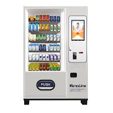

<!-- PROJECT LOGO -->
 
  <h2 align="center">Vending Machine</h2>

  

    A Replication of the working of a Drinks Vending Machine using MongoDB
     
  

<!-- TABLE OF CONTENTS -->

  
Table of Contents

  <ol>
    <li>
      <a href="#about-the-project">About The Project</a>
      <ul>
        <li><a href="#built-with">Built With</a></li>
      </ul>
    </li>
     <li><a href="#Getting-Started">Getting Started</a></li>
    <li><a href="#usage">Usage</a></li>
    <li><a href="#roadmap">Roadmap</a></li>
  </ol>

<!-- ABOUT THE PROJECT -->
## About The Project

The learning objective behind this project was to design a NoSQL Database For a inventory management of the drinks.
The machine handles the drinks vending,coin change with limited denominations and updation of database at the end of transaction.

Features :

* Maintenance Mode - Allows viewing current inventory,adding new drinks,adding stock,Adding denominations,adding change

* Vending Mode - Enables user to buy multiple items in a single transaction and returns change coins in the highest denominations possible using dynamic  coin change algorithm.

### Built With

The major frameworks used in the project -
* [MongoDB](https://www.mongodb.com/)
* [Python](https://www.python.org/)

<!-- GETTING STARTED -->
## Getting Started

* The database is currently local and not hosted as a cluster.

* Database hosting on the web is currently in progress.

<!-- USAGE EXAMPLES -->
## Usage

This is a work under progress,complete deployment information will be shared after the deployment.Stay Tuned...

<!-- ROADMAP -->
## Roadmap

See the [open issues](https://github.com/Consultingcriminal/Vending_Machine/issues) for a list of proposed features (and known issues).

